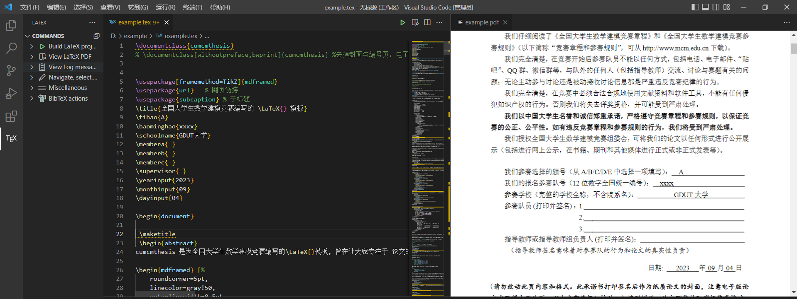

# LATEX安装及VS Code环境配置

## 参考视频和资料

[bilibili最好用LaTex环境安装配置手把手教学！！](https://www.bilibili.com/video/BV1sw411t7Zw?vd_source=b833e2973401c759554df0b806279e2c)

[CSDN配置LaTex最详细版](https://blog.csdn.net/qq_44089921/article/details/107719981)

[vscode latexworkshop:Recipe terminated with error_recipe terminated with error vscode workshop-CSDN博客](https://blog.csdn.net/George_R_Hu/article/details/104238597)

[vscode配置latex出现Recipe terminated with error. Retry building the project.的问题-CSDN博客](https://blog.csdn.net/kangjielearning/article/details/108042628)

## 实现效果

参赛学校改为GDUT大学

目前配置只能实现PDF到代码的单向搜索，双向搜索功能仍在继续配置中
